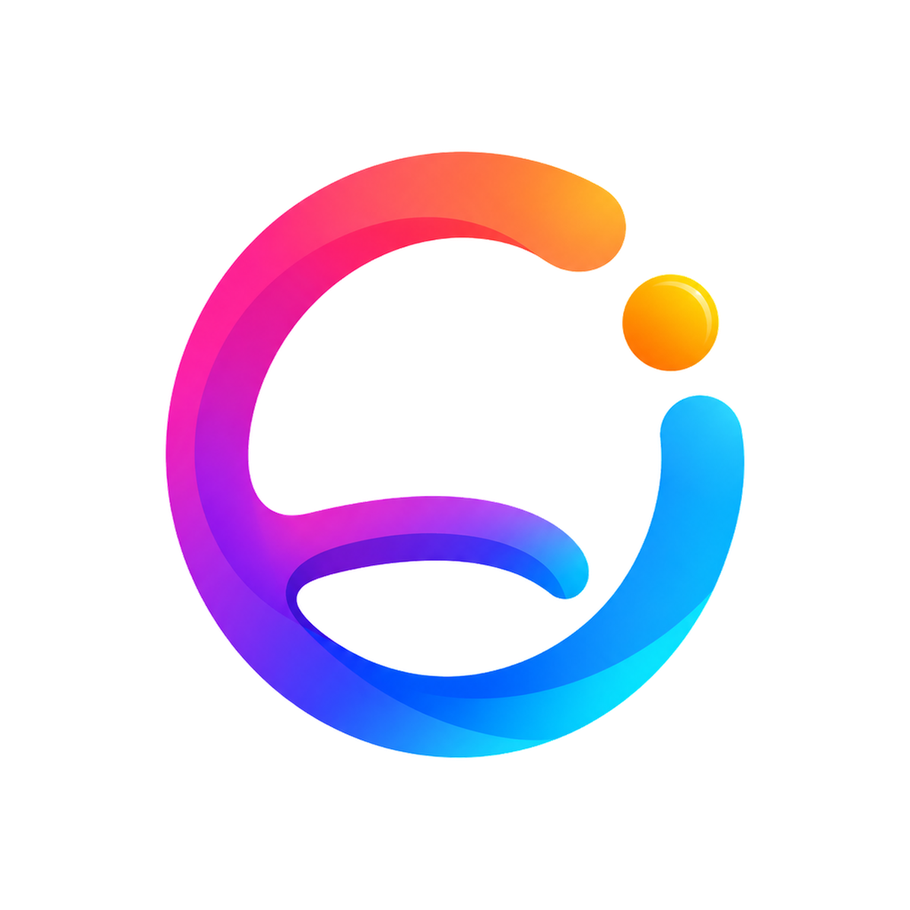
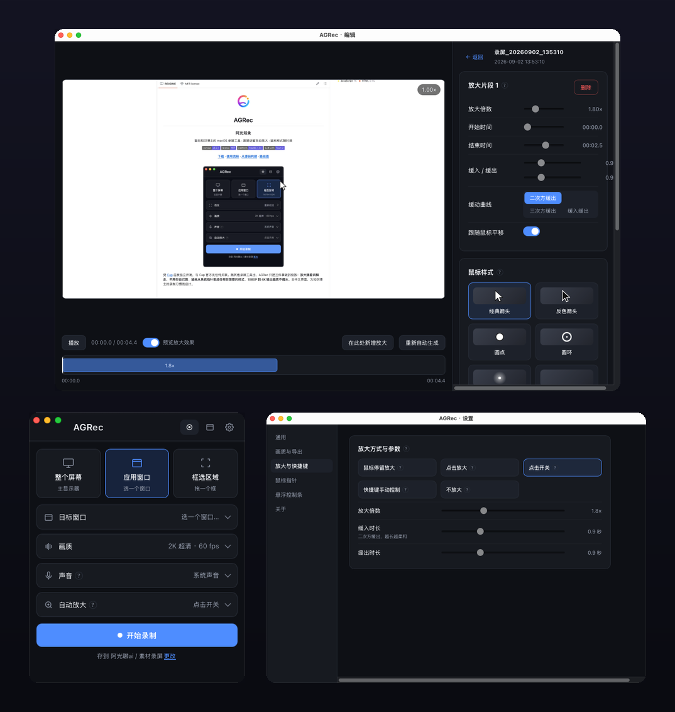
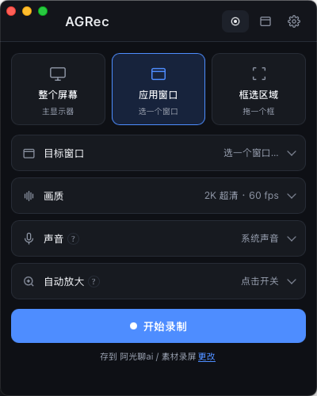
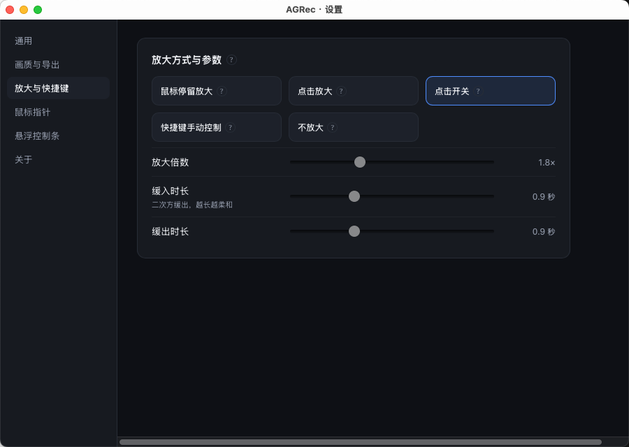
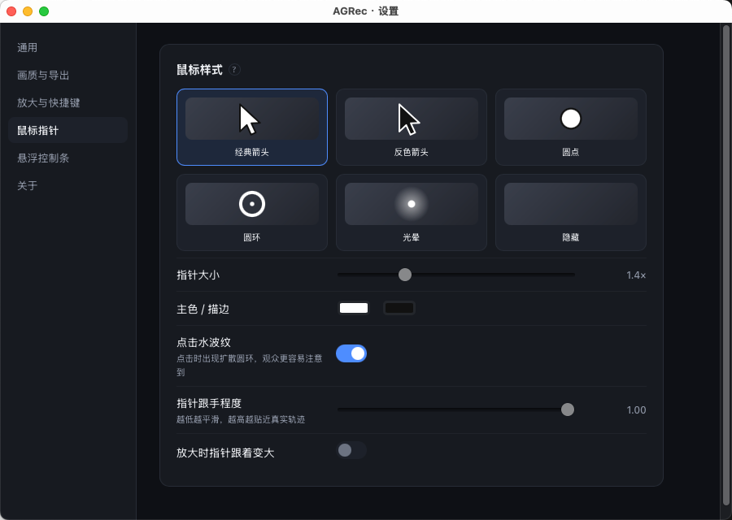
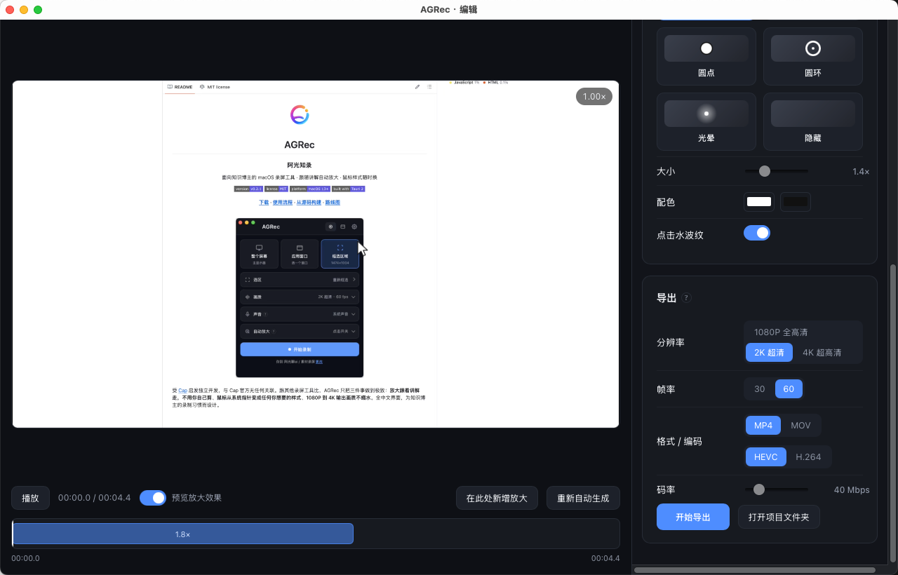
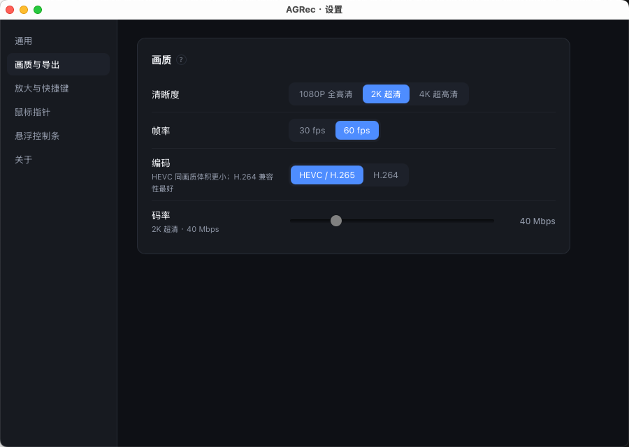
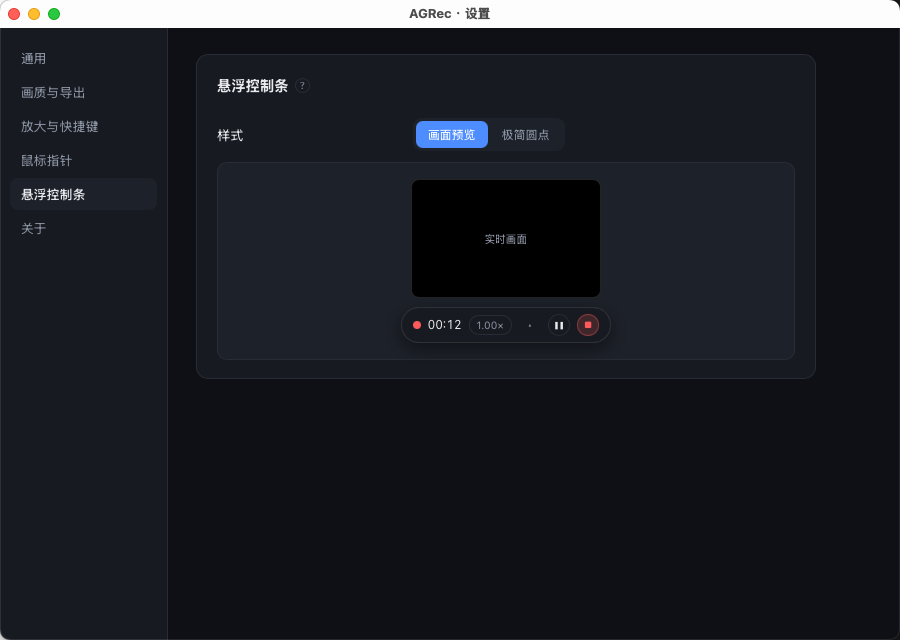

<div align="center">



# AGRec
### 阿光知录

**面向知识博主的 macOS 录屏工具 · 跟随讲解自动放大 · 鼠标样式随时换**

[English](README_en.md) · [官网](https://huipengli0708-dot.github.io/AGRec/)

[](https://github.com/huipengli0708-dot/AGRec/releases/latest)
[](LICENSE)
[](#下载安装)
[](https://tauri.app)

**[下载](https://github.com/huipengli0708-dot/AGRec/releases/latest) · [使用流程](#使用流程) · [从源码构建](#从源码构建) · [路线图](#路线图)**

<br />



</div>

<br />

受 [Cap](https://github.com/CapSoftware/Cap) 启发独立开发，与 Cap 官方无任何关联。跟其他录屏工具比，AGRec 只把三件事做到极致：**放大跟着讲解走，不用你自己剪**、**鼠标从系统指针变成任何你想要的样式**、**1080P 到 4K 输出画质不缩水**。全中文界面，为知识博主的录制习惯而设计。

<br />

## 它是怎么做到的

|  |  |
| :-- | :-- |
| **跟随鼠标放大** | 录完自动分析轨迹：**左键点击** 和 **鼠标在小范围停留** 都会触发放大。缓动默认二次方缓出，倍数、缓入/缓出时长、保持时长、触发灵敏度全部可调，编辑器里还能逐段改、手动加、手动删。 |
| **更换鼠标样式** | 录制时用 `showsCursor = false` **不录系统指针**，同时以 120Hz 记录鼠标轨迹与左键状态；导出时按你选的样式在画面上重绘。所以放大之后指针依然是矢量级清晰，而且随时可以换样式重导。 |
| **1080P / 2K / 4K** | 录制与导出都可独立选择 1080 / 1440 / 2160，编码可选 H.264 或 HEVC，码率可调（4K 默认 80 Mbps）。放大不是滤镜近似——每一帧都按真实裁剪 + 重采样，4K 源放大 2 倍画面依然锐利。 |
| **适合知识博主** | 麦克风讲解直录、点击水波纹提示、停留自动放大、逐段微调、项目文件可反复重导出。 |

<br />

## 界面一览

<table>
<tr>
<td width="33%"><br /><sub align="center">录制面板</sub></td>
<td width="33%"><br /><sub>放大参数设置</sub></td>
<td width="33%"><br /><sub>鼠标样式设置</sub></td>
</tr>
<tr>
<td width="33%"><br /><sub>编辑器 · 导出设置</sub></td>
<td width="33%"><br /><sub>画质与导出设置</sub></td>
<td width="33%"><br /><sub>悬浮控制条设置</sub></td>
</tr>
</table>

<br />

## 下载安装

前往 [Releases 页面](https://github.com/huipengli0708-dot/AGRec/releases/latest) 下载最新的 `.dmg`，拖入「应用程序」即可。

> **首次打开提示"无法验证开发者" / "未打开 AGRec" 怎么办？**
> 这是因为当前发行版还没有付费的 Apple 开发者签名，不影响正常使用，选一种方式放行即可：
>
> - **图形界面**：系统设置 → 隐私与安全性，往下翻找到"AGRec 已被阻止使用"提示，点「仍要打开」
> - **终端一条命令**（更快）：
>   ```bash
>   xattr -dr com.apple.quarantine /Applications/AGRec.app
>   ```
>
> 首次运行还会请求 **屏幕录制**（以及选麦克风时的 **麦克风**）权限，去系统设置里允许后，需要完全退出（⌘Q）AGRec 再重新打开一次，权限才会对录制进程生效。App 内置检查更新，后续版本无需重新下载。

<br />

## 使用流程

1. **录制页**：选录制范围（整个屏幕 / 应用窗口 / 框选区域）→ 选画质 → 选声音来源 → 挑鼠标样式 → 调自动放大方式 → 开始录制。
2. 录制时悬浮控制条不会出现在画面里；点「结束」停止后自动打开独立的编辑器窗口。
3. **编辑器**：左边实时预览放大效果（自定义指针会一起预览），下方时间轴上蓝色块就是自动生成的放大片段。
   - 点选片段 → 右侧调倍数、起止、缓入缓出、缓动曲线、是否跟随鼠标
   - 播放头处「新增放大」可手动补一段
   - 改了参数想重来，点「重新自动生成」
4. **导出**：选分辨率/帧率/编码/码率 → 选保存路径 → 渲染完成后自动在访达中定位。

细节选项（保存位置、画质预设、放大参数、鼠标样式、悬浮条样式）都集中在独立的**设置窗口**（点主面板右上角齿轮图标进入）。

<br />

## 项目文件夹里有什么

```
录屏_20260825_143012/
├── 原始录制.mov      不含鼠标的原始画面（最高画质母版）
├── mouse.json        鼠标轨迹与点击记录
├── project.json       放大片段、鼠标样式等可编辑参数
└── xxx_成品.mp4       导出结果
```

母版和轨迹都保留着，所以任何时候都能改样式、改放大，重新导出一版。

<br />

## 从源码构建

<details>
<summary>环境要求 & 构建命令</summary>

<br />

- macOS 13 Ventura 或更高（ScreenCaptureKit 要求）
- Xcode 16 及以上（或对应的 Command Line Tools）：`xcode-select --install`
- Node.js 18+、Rust（`curl https://sh.rustup.rs -sSf | sh`）

```bash
npm install
npm run app          # 等价于 build-helper.sh + tauri dev
```

打包（本地签名 + 生成安装包）：

```bash
npx tauri icon assets/app-icon.png    # 生成图标（只需一次）
npm run release                        # 通用二进制 + dmg
```

线上 Release 由 GitHub Actions（`.github/workflows/release.yml`）打 tag 自动构建发布，签名与自动更新配置见 [`docs/自动更新.md`](docs/自动更新.md)。

</details>

<details>
<summary>技术结构</summary>

<br />

```
AGRec/
├── helper/                     Swift 原生内核（ScreenCaptureKit + AVFoundation + CoreImage）
│   └── Sources/ZhiLuHelper/
│       ├── main.swift          子命令：displays / permission / record / export
│       ├── Recorder.swift      屏幕录制 + 鼠标轨迹采集 + 音频写入
│       ├── Timeline.swift      逐帧预计算缩放/焦点/指针/水波纹
│       ├── Exporter.swift      自定义 AVVideoCompositing，做裁剪缩放与指针合成
│       └── CursorRenderer.swift 各种指针样式的位图绘制
├── src-tauri/                  Rust 后端（Tauri 2）：进程调度、多窗口（主面板/悬浮条/设置/编辑器）、项目管理、自动放大算法
│   └── src/{main.rs, model.rs, zoom.rs, helper.rs}
├── src/                         React + TypeScript 前端（i18n 多语言界面）
└── scripts/                     build-helper.sh 编译 Swift 内核；release.sh 本地打包；bump-version.sh 统一升版本号
```

</details>

<br />

## 路线图

- [ ] Windows 版本（进行中）
- [ ] 编辑器界面多语言翻译
- [ ] 发布平台预设（小红书 / B站 / 视频号等尺寸与规范，基于真实用户调研后再做）
- [ ] 摄像头画中画（`Info.plist` 已预留权限，未接入）
- [ ] 系统声音与麦克风混音（目前二选一，暂不支持同时录）

**已知边界**：目前仅 macOS（依赖 ScreenCaptureKit），声音一次录一路（麦克风或系统内录，暂不混音），摄像头画中画尚未接入。

<br />

<div align="center">

发现问题或有想法，欢迎提 [Issue](https://github.com/huipengli0708-dot/AGRec/issues)。项目基于 [MIT](LICENSE) 协议开源。

</div>
